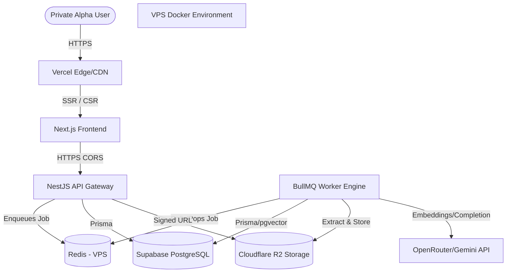

# STUDYAI — FINAL PRIVATE ALPHA DEPLOYMENT ARCHITECTURE

## 1. Executive Verdict
**DEPLOYMENT ARCHITECTURE SELECTED — READY FOR T03 IMPLEMENTATION**

## 2. Repository Identity
- **Repository**: `C:/Users/Hussam/Documents/ViberDownloads/studyai-p0-v2-clean`
- **Branch**: `hardening/p0-reconstruction-5573fd1b-v2`
- **HEAD**: `83ffb7f2553576f259c7b716fa91adefdbce9611`

## 3. Current Runtime Topology
The application runs as a modular monolith. The NestJS API acts as the primary HTTP gateway and concurrently bootstraps a persistent `IWorkerRuntimeEngine` inside the same process using `onApplicationBootstrap`.
- **Frontend**: Next.js (Standalone/SSR).
- **API**: NestJS (Express adapter), handles requests, auth, and database operations.
- **Background Processing**: BullMQ processes heavy document chunking, extraction, and embedding jobs asynchronously. Requires persistent Redis connection and active Node event loop.
- **Database**: PostgreSQL with `pgvector` extension for embeddings. Managed by Drizzle ORM (schema migrations) and Prisma (runtime queries).
- **Storage**: S3-compatible object storage via AWS SDK.

## 4. Runtime Mermaid Diagram

## 5. Persistent-Worker Decision
**Classification:** REQUIRED
The current architecture strictly relies on BullMQ for asynchronous document processing (PDF extraction, embedding generation). BullMQ requires a persistent Node.js event loop and persistent blocking TCP connections to Redis. Vercel Functions spin down when idle, effectively killing the worker engine. Thus, the API and worker require a long-running container or VPS.

## 6. Frontend Deployment Analysis
**Classification:** DIRECTLY COMPATIBLE
Next.js on Vercel is the optimal target. It perfectly aligns with the owner's GitHub-based deployment preference, handles HTTPS/TLS termination, and provides free edge caching and bandwidth for the 5-10 user target.

## 7. API Deployment Analysis
- **Vercel Functions**: INCOMPATIBLE. Kills persistent BullMQ workers and imposes strict request timeouts (max 10-60s on free/pro tiers) which breaks long-running AI streaming/provider requests.
- **Long-running container (Railway/Render)**: COMPATIBLE WITH MINOR CONFIGURATION. However, Node/NestJS + PDF processing often requires 1GB+ RAM, pushing costs above the $10 budget.
- **Single VPS via Docker Compose**: DIRECTLY COMPATIBLE. Predictable $5-$6/mo cost, fully supports persistent processes, local temporary storage, and local Redis.

## 8. PostgreSQL and Migration Analysis
The application requires PostgreSQL with the `pgvector` extension.
- **Supabase PostgreSQL**: Excellent fit. Provides `pgvector` out-of-the-box and a generous Free Tier (500MB database size, ample for text/embeddings for 10 users).
- **Migration Strategy**: Drizzle handles migrations; Prisma handles runtime. Deployment requires setting `DATABASE_URL` (pooled) for Prisma and `DIRECT_DATABASE_URL` for Drizzle migrations.

## 9. Custom-Auth and RLS Analysis
The application enforces authorization natively within NestJS using a custom JWT strategy.
- It does **not** use Supabase Auth.
- Supabase Row Level Security (RLS) cannot natively inspect the custom JWT without complex workarounds (e.g., injecting custom claims per query).
- **Decision**: Connect to Supabase using a standard server role. NestJS safely acts as the sole authorization gateway, preserving the current working source logic. RLS is unnecessary.

## 10. File-Storage Analysis
- **Cloudflare R2**: Highly recommended. $0/mo for 10GB, zero egress fees, fully S3-compatible. Easily integrates with the existing `s3` config in `infrastructure/schema.ts`.
- **Supabase Storage**: Free tier is limited to 1GB. Real study documents (PDFs) will exhaust this quickly.
- **Decision**: Cloudflare R2 for durable storage to prevent unpredictable cost spikes.

## 11. Redis and BullMQ Analysis
- **Upstash Redis**: Risky for standard BullMQ due to restrictive max concurrent connections (250) and daily command quotas on the free tier. BullMQ polling can exhaust quotas rapidly.
- **Managed Redis**: Too expensive for the $10 budget.
- **VPS Redis**: Running a lightweight Redis container alongside the NestJS API on the VPS is free, offers unlimited connections, zero latency, and is perfectly safe since Redis only holds transient job states, not durable user data.

## 12. Backup and Restore Contract
Real user documents mandate data safety.
- **Database**: Supabase Free Tier provides daily physical backups (7-day retention). *Limitation*: No 1-click restore on Free Tier.
- **Logical DB Backup**: A daily `pg_dump` cron job on the VPS storing a logical backup in R2 is recommended for manual restore capability.
- **Files**: Cloudflare R2 offers 99.999999999% durability.
- **Data-Loss Window**: Up to 24 hours. Acceptable for a Private Alpha.

## 13. Domain, HTTPS, email, CORS, and cookie Analysis
- **Domain**: Vercel provides a temporary `.vercel.app` staging subdomain (e.g., `studyai-alpha.vercel.app`).
- **API Domain**: The VPS needs a domain for HTTPS. If the owner has no domain, a free DuckDNS subdomain + Let's Encrypt can be used, or a cheap $2 domain.
- **CORS/Cookies**: The frontend and API origins must be explicitly mapped in NestJS.
- **Email**: Resend (Free Tier - 3,000 emails/mo) or standard SMTP.

## 14. GitHub Deployment Analysis
- **Frontend**: Vercel's native GitHub integration provides automatic preview and production deployments.
- **API**: A GitHub Actions workflow can securely SSH into the VPS, pull the latest image, run Drizzle migrations (`pnpm db:push`), and restart the Docker Compose stack.
- Secrets are securely managed via GitHub Repository Secrets.

## 15. Current Official Provider Evidence
- **Supabase (Accessed 2026-07-31)**: Free tier includes 500MB DB, 7-day physical backups, pauses after 1 week of inactivity (prevented by active API/CRON).
- **Cloudflare R2 (Accessed 2026-07-31)**: 10GB storage, 10M Class B ops/mo, zero egress fees. Free.
- **Vercel (Accessed 2026-07-31)**: Next.js hosting free for non-commercial/hobby use.
- **DigitalOcean/Hetzner (Accessed 2026-07-31)**: 1GB RAM VPS is ~$5-6/mo.

## 16. Monthly Cost Analysis
| Component | Provider | Estimated Cost |
| :--- | :--- | :--- |
| Frontend | Vercel (Hobby) | $0.00 |
| API & Worker | Hetzner or DigitalOcean (VPS) | $5.00 - $6.00 |
| Database | Supabase (Free Tier) | $0.00 |
| Storage | Cloudflare R2 (Free Tier) | $0.00 |
| Redis | VPS (Docker) | $0.00 |
| **Total** | | **~$6.00 / mo** |

## 17. Four-Option Comparison
| Option | Compatibility (25) | Data Safety (20) | Simplicity (15) | Reliability (15) | Cost (15) | CI/CD (10) | **Score** |
| :--- | :--- | :--- | :--- | :--- | :--- | :--- | :--- |
| **A: Full Serverless** | 2/10 (Breaks workers) | 9/10 | 9/10 | 5/10 (Timeouts) | 8/10 | 10/10 | **4.9** |
| **B: Managed Hybrid** | 9/10 | 9/10 | 8/10 | 8/10 | 4/10 (>$15/mo) | 8/10 | **7.8** |
| **C: Single VPS** | 10/10 | 3/10 (High Risk) | 6/10 | 7/10 | 10/10 | 7/10 | **7.2** |
| **D: Hybrid VPS/Data**| 10/10 | 9/10 (Managed DB) | 7/10 | 8/10 | 9/10 (~$6/mo) | 8/10 | **8.7** |

## 18. Selected Architecture
**OPTION D — HYBRID VPS/MANAGED DATA**
- **Frontend Host**: Vercel
- **API & Worker Host**: Single VPS (Docker Compose)
- **Database Host**: Supabase (Managed PostgreSQL)
- **Redis Host**: Local VPS Docker Container
- **File Storage**: Cloudflare R2 (S3 API)
- **Email**: Resend (Free)
- **Data Safety**: Achieved via decoupled managed database and object storage.
- **Compatibility**: 100% compatible with existing NestJS, Prisma, Drizzle, BullMQ, and local temporary file processing logic.

## 19. Manual Owner Prerequisites
1. **Cloudflare Account**: Create account, enable R2, create bucket `studyai-alpha`, generate S3 Access Key & Secret. (Payment card required, $0 charged).
2. **Supabase Account**: Create project, obtain `DATABASE_URL` (connection pooler for Prisma) and `DIRECT_URL` (direct for Drizzle). Disable project pausing.
3. **VPS Provisioning**: Rent a 1GB/2GB Ubuntu VPS (Hetzner, DigitalOcean, or AWS Lightsail). Provide IP address and SSH key.
4. **Resend Account**: Create account, verify sending domain, generate API key.
5. **GitHub Secrets**: Add infrastructure secrets to GitHub repository (`DATABASE_URL`, `R2_ACCESS_KEY`, `VPS_SSH_KEY`, etc.).

## 20. T03 Implementation Roadmap
| ID | Title | Scope | Expected Hours | Tool |
| :--- | :--- | :--- | :--- | :--- |
| T03-1 | Account & Infra Provisioning | Owner provisions VPS, Supabase, and R2. Collects credentials. | 1.0h | Manual Owner Action |
| T03-2 | Docker Compose Baseline | Create `docker-compose.yml` for NestJS + Redis on VPS. | 1.0h | Codex GPT-5.6 Terra |
| T03-3 | Environment Configuration | Configure `.env` integration for `s3` adapter and Supabase URLs. | 0.5h | Codex GPT-5.6 Sol |
| T03-4 | Nginx / TLS Configuration | Setup Caddy or Nginx with Let's Encrypt on VPS for API HTTPS. | 1.5h | Codex GPT-5.6 Terra |
| T03-5 | GitHub Actions CI/CD (API) | Create workflow to deploy API & run Drizzle migrations on push. | 2.0h | Codex GPT-5.6 Terra |
| T03-6 | Vercel Frontend Deployment | Connect repo to Vercel, set API URL env vars, trigger build. | 0.5h | Manual Owner Action |
| T03-7 | E2E Integration Test | Verify file upload, extraction, embedding, and chat in staging. | 1.0h | Antigravity Gemini |
| T03-8 | Backup Cron Configuration | Setup daily `pg_dump` cron script on VPS targeting R2. | 0.5h | Codex GPT-5.6 Terra |

## 21. Principal Risks
- **Free Tier Hibernation**: Supabase pauses free databases after 1 week of inactivity. A scheduled health check ping from Vercel or GitHub Actions is required.
- **Memory Pressure**: Document processing (PDF extraction) is memory-intensive. A 1GB VPS might experience Out-Of-Memory (OOM) kills. A 2GB VPS (Hetzner is ~$6) is highly recommended.
- **RTL Log Bloat**: Ensure Docker log rotation is configured to prevent the VPS disk from filling up over time.

## 22. Final Go/No-Go Decision
**A. READY FOR T03 IMPLEMENTATION**
A clear, compatible, safe, and cost-effective architecture exists. Remaining prerequisites are standard account creation tasks.
