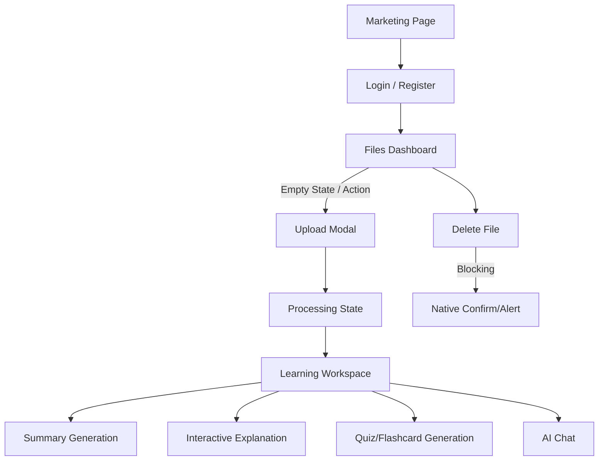

# StudyAI Private Alpha UX Readiness Review

## 1. Executive UX Verdict
The core Private Alpha user journey is functionally sound but requires targeted remediation of fundamental UI patterns before onboarding users. Native browser prompts, invalid HTML nesting, and inconsistent translation approaches degrade both usability and accessibility. 

**Status:** PRIVATE ALPHA UX BLOCKED — CRITICAL PRODUCT DECISION REQUIRED

## 2. Repository Identity
- **Repository:** `C:/Users/Hussam/Documents/ViberDownloads/studyai-p0-v2-clean`
- **Branch:** `hardening/p0-reconstruction-5573fd1b-v2`
- **HEAD:** `1a4b14537a04653a13b4a79e456d511399a004e5`
- **Git status:** Clean (only expected untracked reports present)

## 3. Current Core User Journey
1. **Registration/Login:** Marketing -> Auth layout
2. **Files Dashboard:** Authenticated layout -> Empty state -> Upload modal
3. **Processing:** Native file upload -> Processing overlay -> Progress indication
4. **Learning Workspace:** File detail view -> Summary/Explain/Quiz generation
5. **Action/Logout:** Contextual navigation -> Auth service

## 4. User-Flow Diagram

## 5. Files-Page Findings
- **Delete Behavior:** Uses native `confirm()` and `alert()`, which block the main thread and provide a poor user experience.
- **Filters:** Type and subject filters rely on native `<select>` elements, creating visual inconsistency with the rest of the custom UI.
- **Processing Status:** Polling logic is functional but relies on standard `setInterval` without refined visual transitions.

## 6. Upload and Processing Findings
- **Upload Modal:** Implemented as a basic HTML overlay rather than utilizing the established Base UI `Dialog` component, risking accessibility and focus-trap issues.
- **Feedback:** Error and success states are clear, but rely heavily on hardcoded bilingual strings rather than the `i18n` system.

## 7. Learning-Workspace Findings
- **Information Hierarchy:** Tab navigation is clean. The division between Content, Summary, and Explain is logical.
- **Controls:** AI generation parameters (Depth, Level, Difficulty) use native `<select>` elements.
- **Content Presentation:** Key points and definitions are visually distinct, but `Comprehension Questions` use native `
`/`
` which may lack advanced accessibility attributes.

## 8. Arabic/English Consistency Findings
- **Defect:** There is a heavy mix of hardcoded inline translations (e.g., `locale === 'ar' ? 'تم رفع الملف بنجاح!' : 'File uploaded successfully!'`) instead of utilizing the established `t()` hook and `i18n` dictionaries.
- **Terminology:**
  - Files: ملفاتي / My Files
  - Upload: رفع ملف / Upload File
  - Processing: قيد التحليل / Processing
  - Failed: فشل / Failed
  - Retry: إعادة المحاولة / Retry
  - Summary: الملخص / Summary

## 9. Accessibility Findings
- **Defect:** `<Link><Button></Button></Link>` pattern is present (e.g., in `files/[id]/page.tsx` line 558), rendering invalid HTML (`<a><button>`).
- **Defect:** Native browser dialogs (`confirm`, `alert`) degrade screen reader experiences.
- **Defect:** Native `<select>` elements offer poor custom styling and inconsistent screen reader announcements compared to Radix UI.

## 10. User-Testing Blockers
**GROUP A — MUST FIX BEFORE INVITING ANY USER**
1. Replace native `confirm()` and `alert()` for destructive actions with accessible Dialogs and Toasts.
2. Resolve invalid HTML nesting (`<Link>` wrapping `<Button>`) on non-marketing routes.
3. Migrate hardcoded inline translations to the `i18n` dictionary to ensure reliable RTL/LTR behavior.
4. Replace the custom Upload HTML modal with the standard Base UI `Dialog` component.

**GROUP B — SHOULD FIX BEFORE PRIVATE ALPHA**
1. Replace all native `<select>` elements with the Base UI `Select` component.
2. Improve the visual presentation of the "Empty State" on the files dashboard.

**GROUP C — FIX BEFORE PUBLIC MVP**
1. Enhance the polling mechanism for file processing with smoother transitions.
2. Replace native `
` with a standard Radix UI `Accordion` for explanations.

**GROUP D — DEFER UNTIL USER FEEDBACK**
1. Advanced file type icons and thumbnails.
2. Complex folder structures.

## 11. Deferred Improvements
Visual redesigns, personalized avatars, deep folder nesting, and complex data visualization for quizzes have been deferred until post-alpha feedback.

## 12. Minimal Implementation Plan

1. **Task 1: Resolve Legacy Link/Button Semantics**
   - **Scope:** Convert `<Link><Button>` to `<Link className={buttonVariants()}>` across non-marketing routes.
   - **Model:** Codex GPT-5.6 Sol
   - **Estimated Hours:** 1
   - **Impact:** Fixes critical accessibility defect.

2. **Task 2: Implement Accessible Dialogs for Destructive Actions**
   - **Scope:** Remove `confirm()`/`alert()` in file deletion and replace with Radix `AlertDialog` and `sonner` toasts.
   - **Model:** Codex GPT-5.6 Sol
   - **Estimated Hours:** 1.5

3. **Task 3: Refactor Upload Modal to Base UI**
   - **Scope:** Transition the custom HTML overlay in `files/page.tsx` to the standard Radix `Dialog` component.
   - **Model:** Codex GPT-5.6 Sol
   - **Estimated Hours:** 1.5

4. **Task 4: Standardize UI Selectors**
   - **Scope:** Replace native `<select>` elements in filters and AI controls with Base UI `Select`.
   - **Model:** Codex GPT-5.6 Sol
   - **Estimated Hours:** 2

5. **Task 5: Unify Translation Layer**
   - **Scope:** Extract hardcoded Arabic/English strings into the JSON dictionaries and replace with `t()` calls.
   - **Model:** Codex GPT-5.6 Terra
   - **Estimated Hours:** 2

## 13. Recommended Design Direction
- **Width:** Max-w-6xl for workspaces to maintain readability.
- **Status Chips:** Stick to the current solid color-coded schema (Emerald=Completed, Rose=Failed, Amber=Processing).
- **Typography:** Retain current scale. Do not introduce new font families.
- **Buttons:** Primary actions (Upload, Generate) should be solid indigo. Destructive (Delete) should be ghost-rose.
- **Rule:** Do not introduce a new UI library. Stick to Radix + Tailwind.

## 14. Legacy Button/Link Pattern Classification
- **Classification:** Confirmed current console/accessibility defect.

## 15. Estimated Hours to Private Alpha UX Readiness
- **Total Estimated Hours:** 8 hours of focused frontend engineering.

## 16. Recommended First Implementation Task
- **Task:** Task 1: Resolve Legacy Link/Button Semantics.

## 17. Tool/Model Recommendation
- **Tool:** Base UI refactoring.
- **Model:** Codex GPT-5.6 Sol.
- **Reasoning Level:** Medium (Focused component work).

## 18. Final Conclusion
The interface provides a solid foundation but currently relies on shortcuts (native prompts, custom overlays, hardcoded strings) that compromise accessibility and professional feel. Resolving these 5 minimal tasks will elevate the UI to a safe, testable standard for the Private Alpha cohort.
